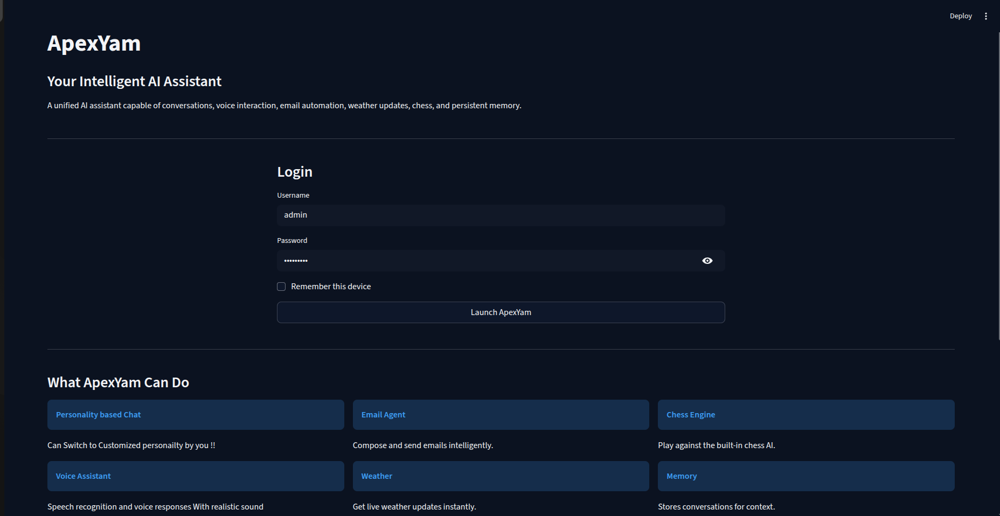
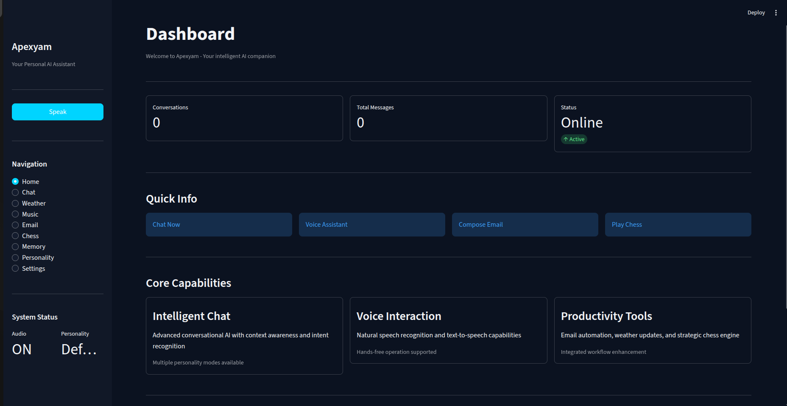
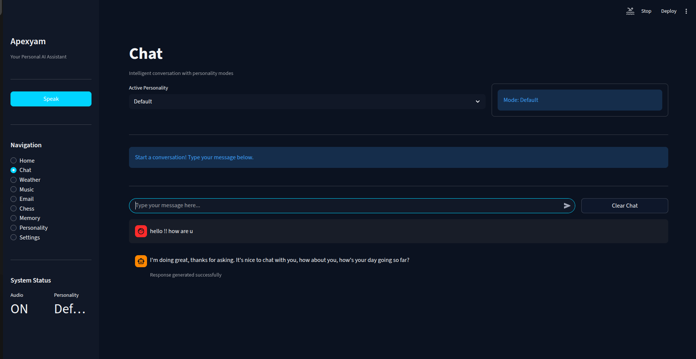
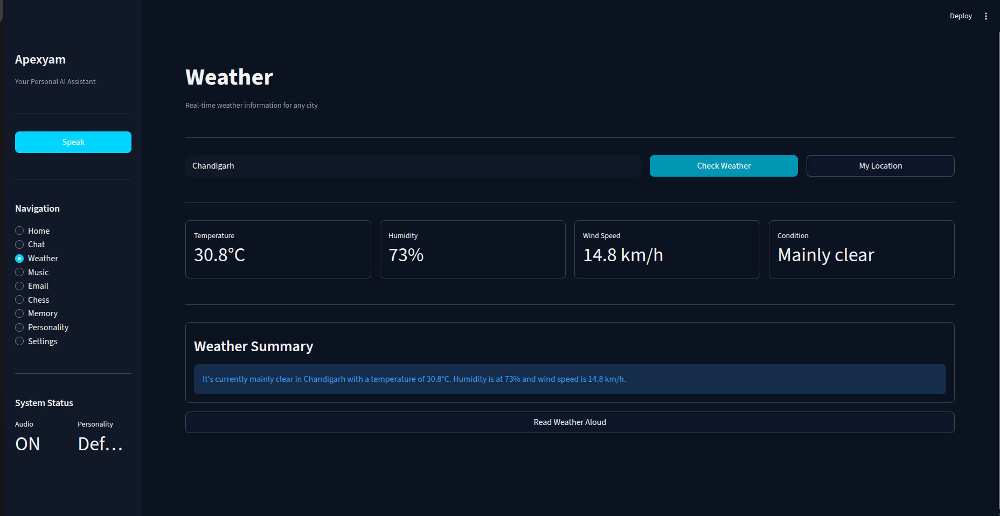
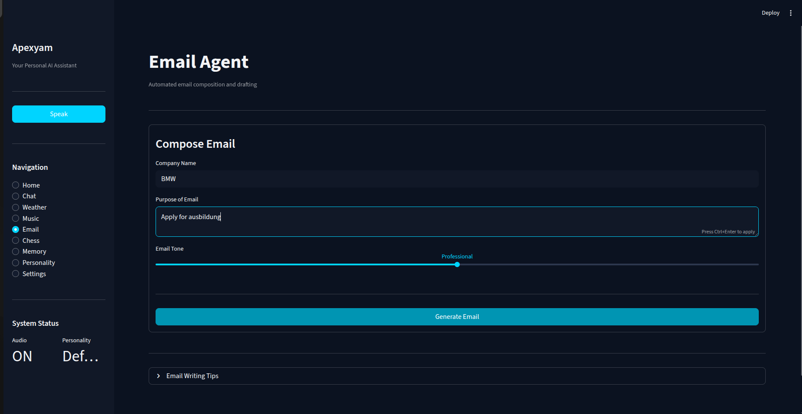
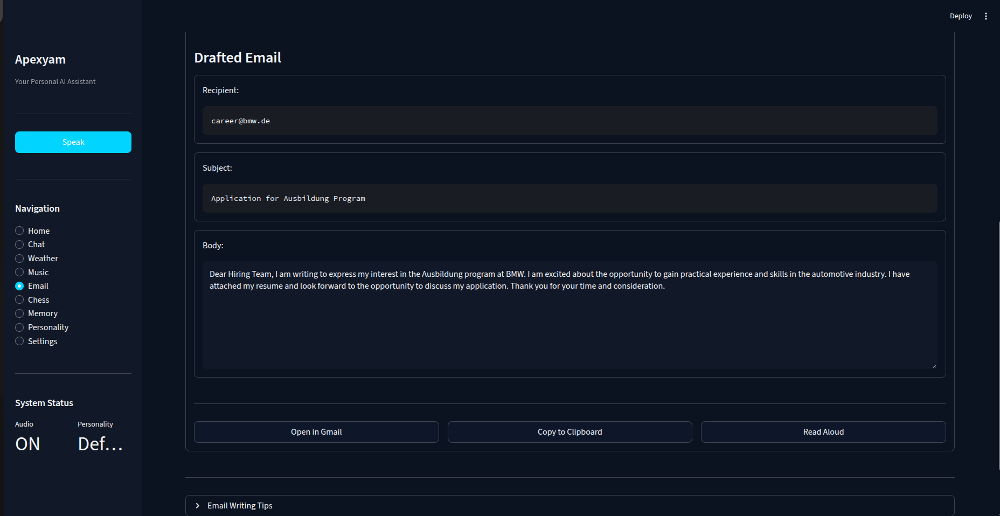
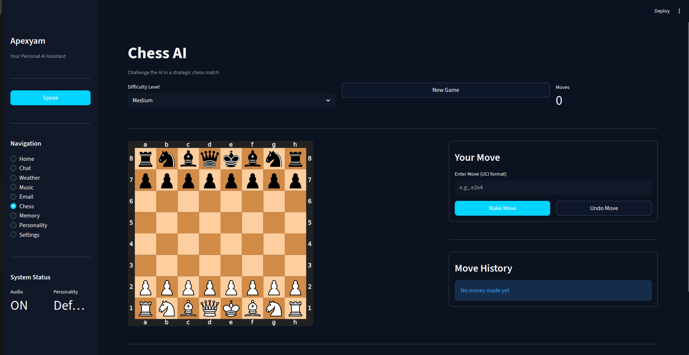
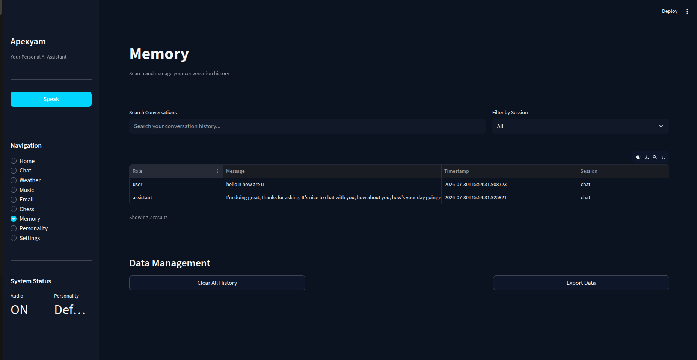
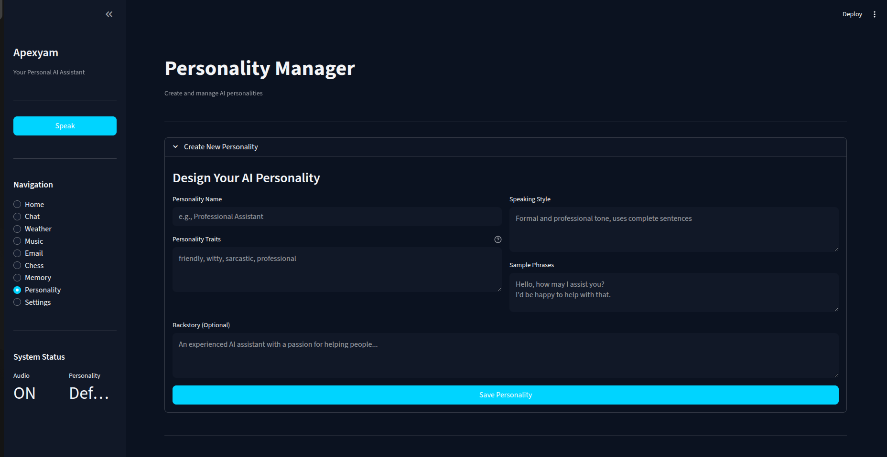

# ApexYam

ApexYam is an AI-powered personal assistant built using Python and Streamlit. It combines conversational AI with productivity features such as voice interaction, AI-powered email generation, weather updates, music playback, personality customization, memory management, and a chess engine within a single application.

The goal of this project is to demonstrate how multiple AI-driven utilities can be integrated into a unified and user-friendly desktop application.

Live Demo:
Deployment is currently unavailable because the project depends on
Pygame for audio playback and desktop-specific features that are not
supported by common cloud hosting platforms.

A demonstration Screenshots are provided below.

---

# Table of Contents

- Overview
- Features
- Application Screenshots
- Technology Stack
- Project Structure
- Installation
- Environment Variables
- How It Works
- Future Improvements
- Author

---

# Overview

Modern AI assistants often focus on a single capability such as chatting, voice interaction, or automation. ApexYam brings these capabilities together into one application.

The application is designed with a modular architecture where each feature is implemented independently, making it easier to maintain, extend, and improve over time.

The interface is built with Streamlit while the backend is implemented entirely in Python.

---

# Features

## AI Assistant

- Natural language conversations
- Fast AI responses powered by the Groq API
- Context-aware interactions

---

## Voice Interaction

- Speech recognition
- Text-to-speech responses
- Hands-free interaction

---

## Email Assistant

- Generate professional emails using AI
- Convert prompts into complete email drafts

---

## Weather Information

- Real-time weather updates
- City-based weather search

---

## Music Playback

- Play music directly from the assistant
- Simple command-based interface

---

## Chess Engine

- Play against the Stockfish chess engine
- Interactive chess board

---

## Personality Management

- Multiple assistant personalities
- Easy personality switching

---

## Memory Management

- Store and retrieve conversation history
- Better contextual responses

---

## Secure Authentication

- Password protected login
- Environment variable based configuration

---

# Application Screenshots

## Login Page

Secure authentication before accessing the assistant.



---

## Dashboard

The main interface providing access to all available features.



---

## AI Chat

Interact naturally with the AI assistant.



---

## Weather Module

Retrieve current weather information for any city.



---

## Email Generation

Provide a simple prompt.



Generated email output.



---

## Chess Module

Play chess against the integrated Stockfish engine.



---


## Memory Manager

View stored conversations and memory.



---

## Personality Manager

Switch between different AI personalities.



---

# Technology Stack

## Frontend

- Streamlit

## Backend

- Python

## AI

- Groq API

## Libraries

- Requests
- SpeechRecognition
- Edge-TTS
- Pygame
- yt-dlp
- python-chess
- Stockfish
- bcrypt
- pandas
- python-dotenv

---

# Project Structure

```
ApexYam/
│
├── app.py
├── config.py
├── requirements.txt
├── README.md
├── .env.example
│
├── assets/
├── modules/
├── personalities/
├── downloads/
└── Apexyam_Images/
```

---

# Installation

Clone the repository.

```bash
git clone https://github.com/your-username/ApexYam.git
```

Move into the project directory.

```bash
cd ApexYam
```

Install all dependencies.

```bash
pip install -r requirements.txt
```

Create a `.env` file using the provided `.env.example`.

Run the application.

```bash
streamlit run app.py
```

---

# Environment Variables

Create a `.env` file and configure the following variables.

```env
GROQ_API_KEY=

APP_PASSWORD=

SMTP_EMAIL=

SMTP_PASSWORD=
```

---

# How It Works

1. User authentication is performed at login.
2. The dashboard provides access to different assistant modules.
3. User requests are processed by individual modules.
4. AI requests are sent to the Groq API.
5. Responses are displayed through the Streamlit interface.
6. Additional modules handle email generation, weather information, voice interaction, chess gameplay, and memory management.

---

# Future Improvements

- Deployment
- Image generation
- File summarization
- Plugin architecture
- Multi-language support
- Cloud synchronization
- Multiple Users profiles
- Mobile-friendly interface

---

# Author

Developed by **Sai Satyam**

This project was created as part of my learning journey in Python, artificial intelligence, and application development. It reflects my interest in building practical AI-powered software with clean interfaces and modular architecture.
